# **PYTHON QUIZ**

Welcome to my Code Institute Project 3 python app.

## [**Table of Contents**](<#table-of-contents>)

[**OVERVIEW**](<#overview>)

[**EARLY CONCEPT**](<#early-concept>)

[**FLOWCHART**](<#flowchart>)

[**DEPLOYED APP**](<#deployed-app>)
   * [**Menu**](<#menu>)
   * [**Instructions**](<#instructions>)
   * [**Scoretable**](<#scoretable>)
   * [**Choose category**](<#choose-category>)
   * [**Play Game**](<#play-game>)
   * [**UI UX**](<#ui-ux>)
   * [**Notes**](<#notes>)

[**FUTURE FEATURES**](<#future-features>)

[**TESTING**](<#testing>)
   * [**Bugs squashed**](<#bugs-squashed>)
   * [**Known issues**](<#known-issues>)

[**TECH USED**](<#tech-used>)

[**DEPLOYMENT**](<#deployment>)

[**ACKNOWLEDGEMENTS**](<#acknowledgements>)

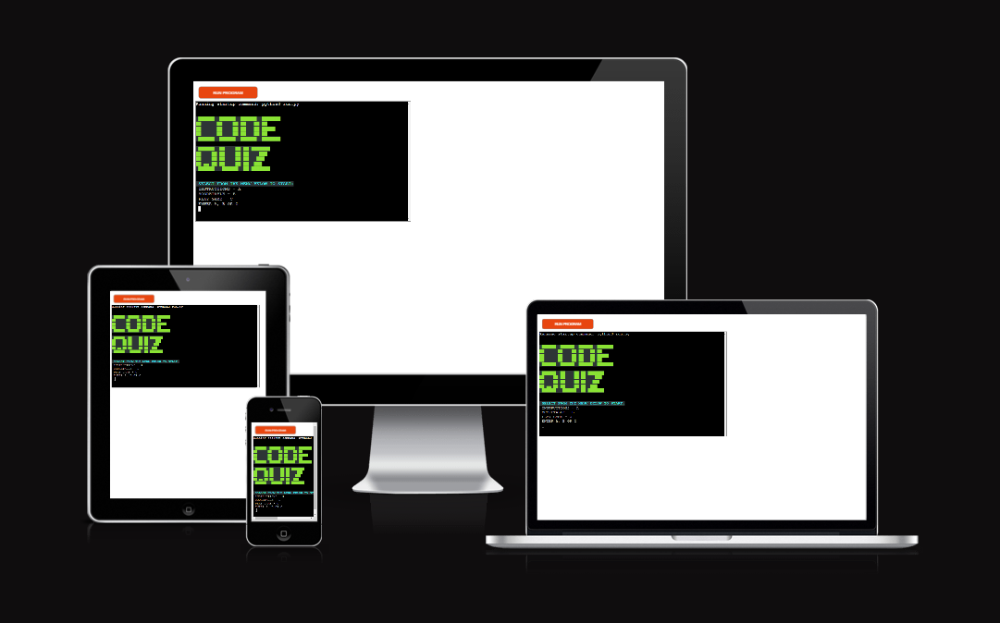

--------------------------------------------------------
### OVERVIEW

* The purpose of this project was to show a working app created with Python from scratch. No code base or examples were used (save for the occasional code hint for a specific problem) but all functions were custom designed for this project. My early idea was to design some form of text based adventure, but I didn't want to get bogged down writing a story when displaying what I have learned in terms of coding was the desired result.

* Eventually I decided on a quiz app, it still combined a slightly light hearted fun game concept but required less creative writing and allowed me focus more on showing what I had learned.

* I decided to store all the questions and scores in an external spreadsheet to show I had understood that part of the previous lesson. But in reality there is little reason to store the questions in this manner.

* It is worth noting were a quiz app really required, there are far better technologies to build that in. But again this was purely to show what I had learned.

### [Contents Menu](<#table-of-contents>)
--------------------------------------------------------
### EARLY CONCEPT

#### NOTE - THE TEST VERSION DETAILED BELOW NO LONGER FUNCTIONS AND IS PRESENTED PURELY TO SHOW MY WORKFLOW FROM TEST TO FINISHED APP
#### THE LINK TO THE REPO CAN BE FOUND [HERE](https://github.com/JeffreyBull76/quiz-test)

* Once a quiz game had been settled on I took a little time to build a test version on github, I chose not to publish this to Heroku. It was purely for testing how I might construct a quiz. So a very basic question and answer function was created that accessed questions from an external spreadsheet. 

* This early version used iteration to grab the questions from the excel sheet one by one and then passed them to the app to ask the question. While this worked it required many back and forth data requests with the spreadsheet. As this is running on a free version of the google API, this resulted in API errors when the user entered invalid inputs. As it requested the data each time the question was asked, so the user could easily accidentally crash the app.

* This was then addressed with a more efficient pull request from the spreadsheet which rather than asking each question from the sheet, pulled the data row by row and built a list of lists, held as a global variable. We could then iterate through that list. This worked far better and was initially the version I built the main app with. It can be seen in the above link under the file name ***RUN.PY*** (as noted above this no longer functions correctly but is presented as proof of concept)

* The test.py file shows a test of another even more efficient way to access the questions, this was eventually used in the early versions of the main app see [***DEPLOYED APP***](<#deployed-app>) section for more information.

* The quiz.py file is presented as it contains a now defunct version of the code used in the final app. I presented this here to show how much more efficient I made the process after initial testing. But it was not initially part of this test version.

### [Contents Menu](<#table-of-contents>)
--------------------------------------------------------
### FLOWCHART

* Here you can see the general overview of the app and how the user navigates through it. 
* Each arrow has at least one validation process in place to prevent invalid inputs.

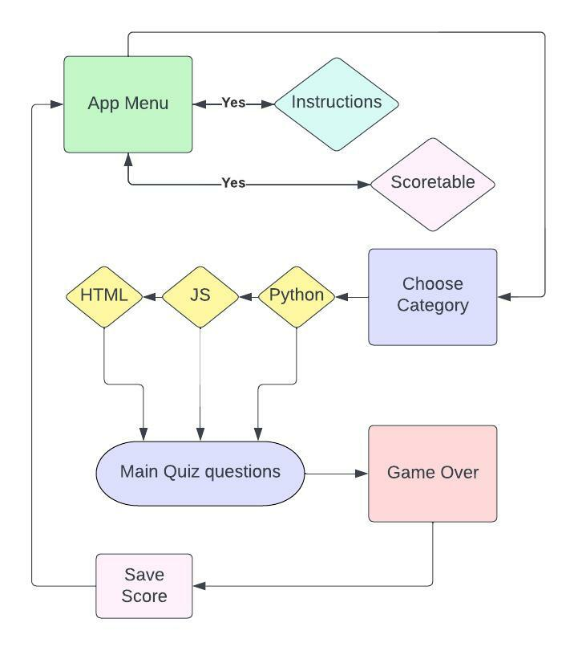

### [Contents Menu](<#table-of-contents>)
--------------------------------------------------------
### DEPLOYED APP

[LINK TO DEPLOYED APP](https://ciproject3-python-quiz.herokuapp.com/)

[LINK TO EXTERNAL SPREADSHEET](https://docs.google.com/spreadsheets/d/1RcMyTLJekKmNepdwI0txN36-tdB3zwwoI31VFOC6FOo/edit#gid=7756837)

* ### Menu
   * The main menu screen:
   * 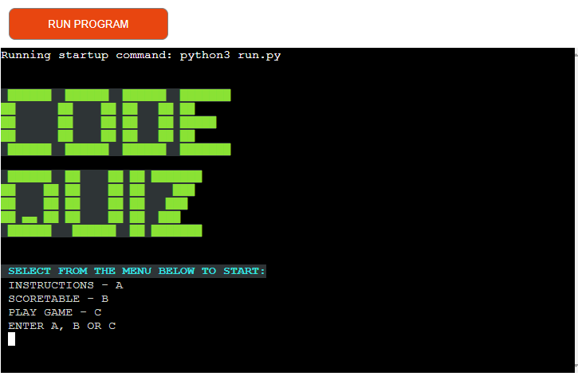
   * This is our deployed landing page. It presents the user with 3 options (see flowchart)
   * As you will see throughout the project, a function is used here to explicitly check for the required input or a loop will continue asking the player to select correctly.
   * Instructions gives a brief overview of how to use the app and returns the user automatically to the menu
   * Scoretable loads the saved scores from out external spreadsheet and uses an imported library called [Tabulate](https://pypi.org/project/tabulate/) to build a scoretable
   * And play game takes us to a catgeory choice screen

### [Contents Menu](<#table-of-contents>)
--------------------------------------------------------
* ### Instructions
   * 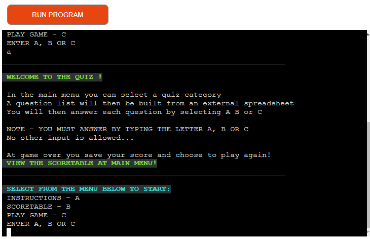
   * As detailed above this lays out how to use the app
   * A choice was made to automatically send the user back to the menu as no further interaction is required. 
   * This cuts down on code and pointless requests for user input.

### [Contents Menu](<#table-of-contents>)
--------------------------------------------------------
* ### Scoretable
   * 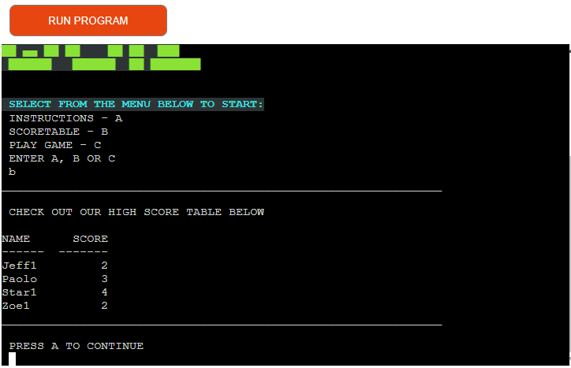
   * This function pulls the data from our spreadsheet (all saved scores are grabbed) and uses the imported tabulate library to display those for the user
   * It works by using the gspread get_all_values function to build a list of lists with one easy request.
   * This then requires a user input to return to the main menu. That works on a very simple while loop inside the function itself to validate input.

### [Contents Menu](<#table-of-contents>)
--------------------------------------------------------
* ### Choose category
   * 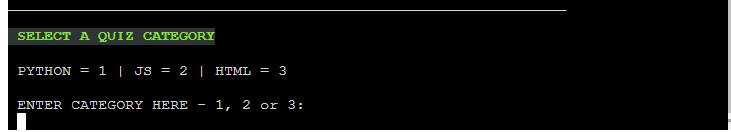
   * This part of the quiz presented the biggest challenge, or rather threw up the most issues. This part went through numerous changes mainly to prevent pointless calls to the external spreadsheet which kept throwing up API errors when we exceeded the free limit per minute.
   * Ultimately it takes the users selection, loads those questions into a list of lists and then returns that value to the 'game loop'.
   * 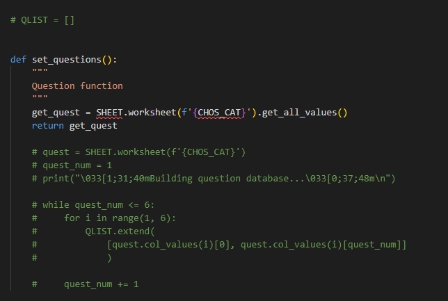
   * Above you can see the original code (commented out in green) vs the newest most up to date way of building the question list.
   * As you can see the current version is far more efficient requiring just one call.

### [Contents Menu](<#table-of-contents>)
--------------------------------------------------------
* ### Play game
   * 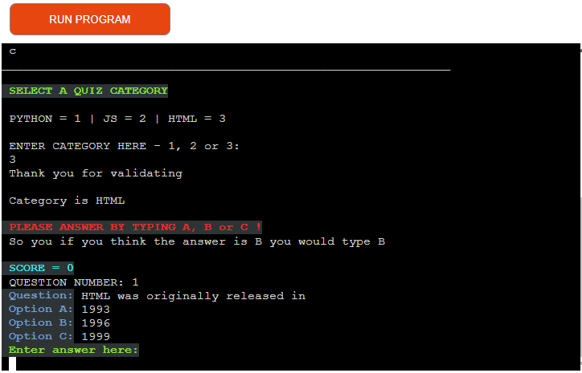
   * Upon choosing a category the main game loop then begins. With 2 values being set which are used to access our list of lists (which hold the questions and answers)
   * Below is presented to show an earlier version of the code before the more efficient call method mentioned above was implemented.
   * 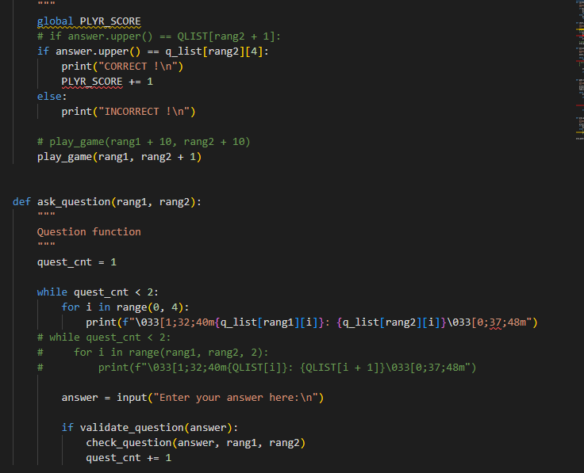
   * As you can see the new version required a few more values to be passed between the functions, but ultimately meant the entire app was more efficient and less clunky.
   * With each question the users input is checked as mentioned previously for validity.
   * Assuming a valid input we then check to see if the answer was correct and either increment the score and ask the next question. Or leave the score as is and ask the next question. 
   * This continues for 10 questions (the arbitrary question count I picked) and then the user is presented with the below.
   * 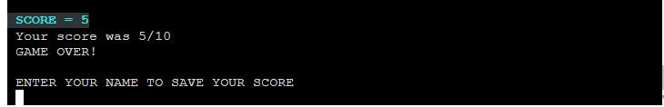
   * At which point valid name input is checked,  if successful the score is saved to our spreadsheet and the game loops back to the main menu.

### [Contents Menu](<#table-of-contents>)
--------------------------------------------------------
* ### UI UX
   * At all stages of the apps running process all input is checked for validity with a relevant error message displayed for user feedback when those checks fail.
   * It is worth noting that try blocks were considered for this as they allow for many states to be checked. But in this instance as the user input is almost exclusively just required to be one of 3 keys, if / else statements seemed more efficient and cleaner.
   * 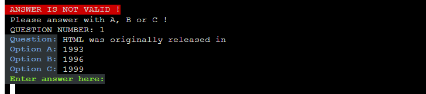
   * The exception to the above was the name entry on game over.
   * The first version of this checked to see if the users name exceeded a certain value, and if it did it saved this with the score to the spreadsheet.
   * After a mentor sesssion it was pointed out this feature had issues, as the way the data is written is in list form. The user could 'break' this by adding blank spaces in their name or worse yet simply add 5 blankspaces
   * This was fixed by doing two things.
        * First the input is run from another variable call which strips it of any blankspaces
        * Then this is checked for a length between 4 and 8 characters (after blankspace removal)
        * I believe this is now somewhat bulletproof (so to speak)
        * If the user attempts to enter an invalid name it displays the below
   * 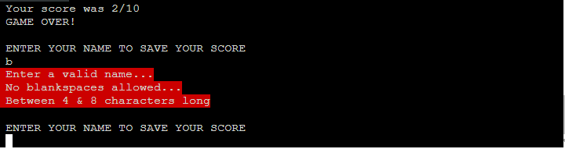
   
### [Contents Menu](<#table-of-contents>)
--------------------------------------------------------
* ### Notes
   * Classes were considered to create the questions, this is still possibly a better solution. But again this was a fairly simple quiz app so it seemed needless to do this, when a simple few functions that get reused already could perform the same thing.
   * Ultimately it felt like inserting them was being done for the sake of it and I decided against their use.
   * The amount of questions was picked for brevity, in reality this could be any number.
   * Equally more categories could easily be added.

### [Contents Menu](<#table-of-contents>)
--------------------------------------------------------
### FUTURE FEATURES
   * A way to display the scores in a more interesting way wass considered. For example allowing the user to select top 3 or order them by value, this could have been done but felt needlessly clunky for such a simple score set. Could be added in future if the app ever saw actual use.
   * Many more questions could exist in any live version, at which point a randomiser function could be added. This could easily be done by simply grabbing the questions in a slightly randomised way then ommitting that choice from subsequent calls.
   * Also following the above a way to select question count and seperate score tables for each 'difficulty'

### [Contents Menu](<#table-of-contents>)
--------------------------------------------------------
### TESTING

* Early versions of the main app had the menu and the quiz part in seperate .py files. One calling the other. This worked but created PEP8 warnings for calling variables not present in each file, it ultimately felt unwieldy and pointless to have it work this way, so all code was consolidated into 1 single run.py file. The quiz.py file in the quiztest repo [**HERE**](<#early-concept>) is an exmaple of how the quiz code worked when it was seperate. Consolidating this into one file took a little work but was worth it from an efficiency and clarity point of view.

* Migrating the code into 1 file and various functions meant adding various data variables across numerous functions so these were passed between the various loops (such as question number, score, etc)

* Ultimately 2 global variables exist. While possible to remove these (and in a larger more complex app it would be worthwhile to do so) it felt cleaner and more efficient to track the chosen category, and score, globally. These are constants throughout the quiz. Both are altered by user input at various points. The score is cleared on starting a new game, and the category is simply overwritten with each new game as required.

* As mentioned previously I ran into API errors in early versions due too many calls to the spreadsheet.

* Due to PEP8 site being down the PEP8 validator was added to the workspace and returned the errors below.
* 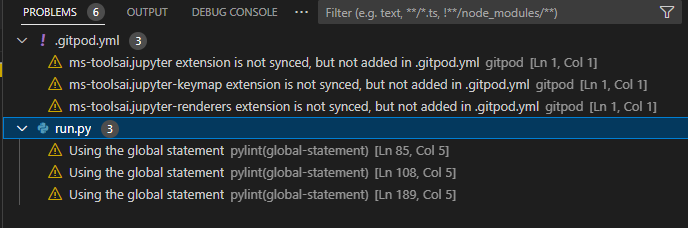

* Of those the first 3 are related to the CI template and I was informed by CI staff these could be ignored.
* The other 3 relate to the use of a global variable, I felt it was cleaner to store them this way. I could have migrated all variables inside functions and passed their values around. But I already had a number of values passed around my game loop so it felt more efficient to store the two constants globally.

### [Contents Menu](<#table-of-contents>)
--------------------------------------------------------
### TECH USED

* [External Google Spreadsheet](https://www.google.com/sheets/about/)
* [Google cloud to handle API requests](https://console.cloud.google.com/)
* [Tabulate Library import](https://pypi.org/project/tabulate/)
* [Colored text codes](https://ozzmaker.com/add-colour-to-text-in-python/)
* [Gspread Python API](https://docs.gspread.org/en/v5.6.1/)
* [Heroku for deployment](https://www.heroku.com)

### [Contents Menu](<#table-of-contents>)
--------------------------------------------------------
### DEPLOYMENT

* Code was written in Gitpod by creating a repo from the initial CI template [HERE](https://github.com/Code-Institute-Org/python-essentials-template)
* ### Forking the repository
   * A copy of the GitHub Repository can be made by forking the GitHub account. This copy can be viewed and changes can be made to the copy without affecting the original repository. Take the following steps to fork the repository;
   * Log in to GitHub and locate the repository.
   * On the right hand side of the page inline with the repository name is a button called 'Fork', click on the button to create a copy of the original repository in your GitHub Account.

* ### Cloning the repository
   * Under the repo’s name, click on the code tab.
   * In the Clone with HTTPS section, click on the clipboard icon to copy the given URL.
   * In your IDE of choice, open Git Bash.
   * Change the current working directory to the location where you want the cloned directory to be made.
   * Type git clone, and then paste the URL copied from GitHub.
   * Press enter and the local clone will be created.
* ### Deploying to Heroku
   * I needed a requirements.txt as a few imports are used. 
   * An ignore file is used to prevent publishing sensitive email data contained in our creds.json file.
   * This was then deployed to Heroku (see link above)
   * Buildpacks were added as required as was the data in our creds.json file.
   * It is vitally important to ensure buildpacks are added in the correct order.
   * This was all done under the settings tab where our config.vars are also added (the data in our creds.json file and port value) 
   * This was then deployed manually to ensure control over the live version
   * You do this by navigating to deploy tab and selecting manual or automatic.
* ### Ensuring our spreadsheet is accessible
   * This was done following the instructions in the CI love sandwiches project to allow our API to access the spreadsheet.
   * Most importantly we allow access to the file by clicking share and entering our value from the creds.json file.

### [Contents Menu](<#table-of-contents>)
--------------------------------------------------------
### ACKNOWLEDGEMENTS

* Thanks to my Mentor for testing this at short notice and highlighting numerous points of improvement, and noticing a large bug in relation to name entry.
* Thanks to the CI staff who cleared up some questions I had relating to this project.
* And mostly thanks to my wife for putting up with me being mostly AWOL while building this :)

### [Contents Menu](<#table-of-contents>)
--------------------------------------------------------
